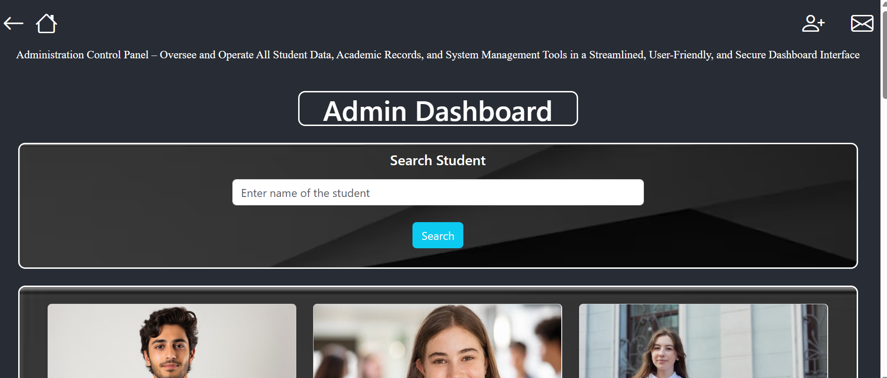
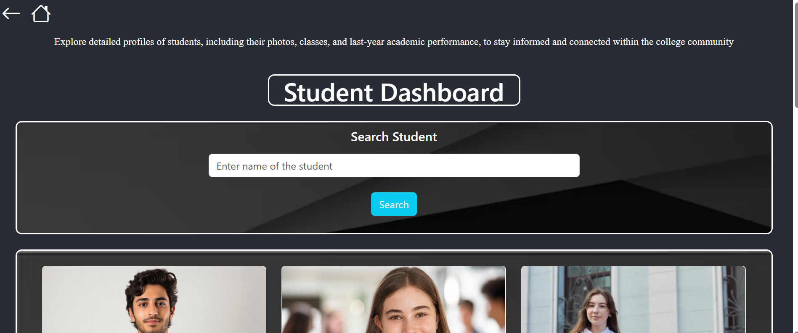
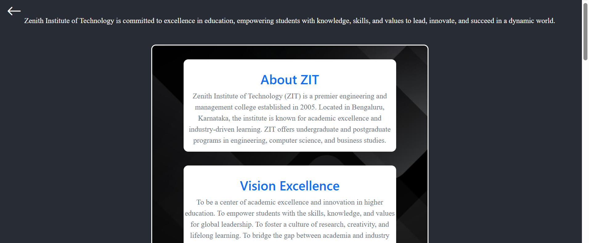
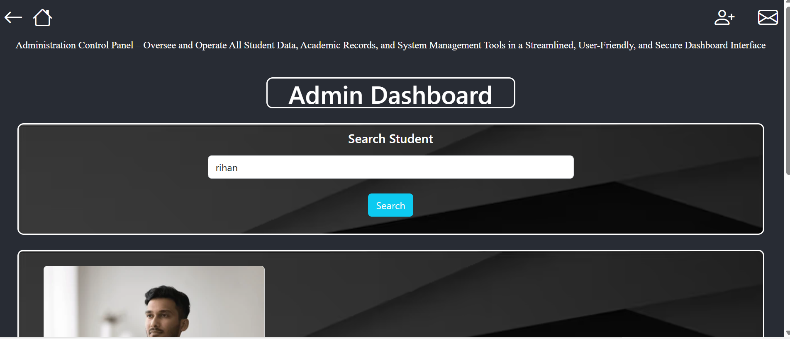
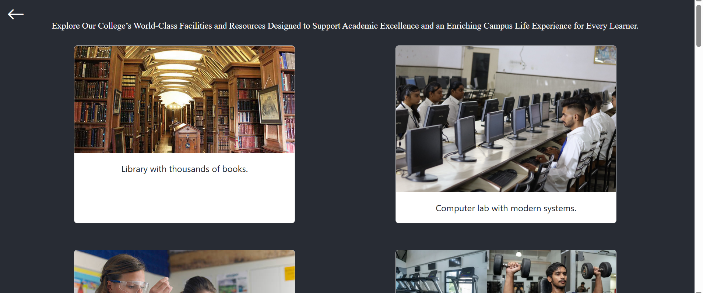
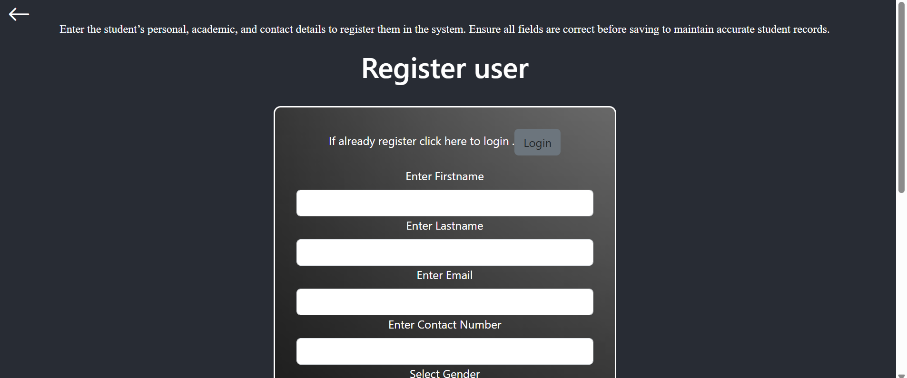
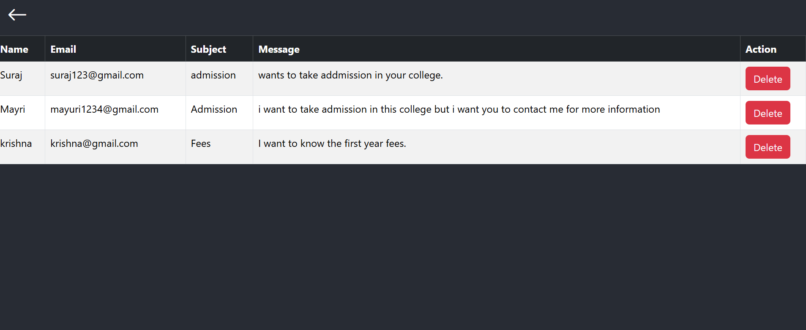

# 🎓 Student Management System

A web-based Student Management System built with **React.js**, **Spring Boot**, and **MySQL**.  
It provides both **Admin** and **Student Dashboards** with features like student management, search, and a contact system.

---

## ✨ Features
- 👨‍💻 **Admin Dashboard**
  - Add new students  
  - Update student details  
  - Delete students  
  - View and manage student records  
  - Manage contact messages (reply via email / delete messages)  

- 🎓 **Student Dashboard**
  - View personal details  
  - Search for other students by name  
  - Contact Admin through the website  

- 🔍 **Search Functionality**  
  - Search students by name  

- 📬 **Contact Feature**  
  - Students/visitors can send a message  
  - Admin receives the message and replies via email  

---

## 🛠️ Tech Stack
- **Frontend**: React.js, Bootstrap 5  
- **Backend**: Spring Boot (Java)  
- **Database**: MySQL  
- **Others**: REST APIs, GitHub for version control  

---
## 🚀 Setup Instructions

### 1. Backend (Spring Boot)
1. Open the `backend` folder in Eclipse or IntelliJ.  
2. Configure MySQL database in `application.properties`.  
3. Run the Spring Boot application.

### 2. Frontend (React)
1. Open the `frontend` folder in VS Code.  
2. Run `npm install` to install dependencies.  
3. Run `npm start` to launch the frontend.

## 📸 Screenshots

### Admin Dashboard

### Student Dashboard

### About Us Page

### Student Search (Admin)

### Home Page

### Facilities Page

### Register Page

### View Messages Page

---

## 🚀 Setup Instructions

### 1. Backend (Spring Boot)
1. Open the `backend` folder in Eclipse or IntelliJ.  
2. Configure MySQL database in `application.properties`.  
3. Run the Spring Boot application.

### 2. Frontend (React)
1. Open the `frontend` folder in VS Code.  
2. Run `npm install` to install dependencies.  
3. Run `npm start` to launch the frontend.

---

## 📸 Screenshots
- Admin Dashboard  
- Student Dashboard  
- Register Page  
- View Messages  

---

## About
A full-stack Student Management System that allows admins to manage students and messages, while students can view their data, search other students, and contact the admin.
